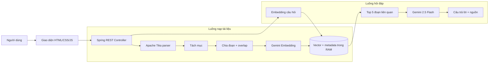

# RAG Document Assistant

Ứng dụng web hỏi đáp nội dung trong tài liệu PDF, DOC và DOCX bằng **Retrieval-Augmented Generation (RAG)**. Hệ thống đọc tài liệu, chia nội dung thành các đoạn nhỏ, tạo embedding, lưu vector trong RAM, truy xuất 5 đoạn gần nhất và dùng Gemini để tạo câu trả lời có dẫn nguồn.

> Đồ án môn Java Spring 2 — Java 21, Spring Boot 4, LangChain4j và Gemini API.

## Chức năng

- Tải lên tài liệu PDF, DOC hoặc DOCX, tối đa 10 MB.
- Trích xuất chữ bằng Apache Tika.
- Nhận diện tiêu đề/mục và chia tài liệu thành các đoạn có phần chồng lấn.
- Tạo embedding bằng `gemini-embedding-001` và lưu bằng `InMemoryEmbeddingStore`.
- Đặt câu hỏi bằng tiếng Việt qua giao diện web.
- Truy xuất tối đa 5 đoạn liên quan bằng độ tương đồng vector.
- Sinh câu trả lời bằng `gemini-2.5-flash`, chỉ dựa trên ngữ cảnh truy xuất.
- Hiển thị nguồn gồm tên tệp, tên mục, số đoạn, độ tương đồng và trích đoạn.
- Xem danh sách tài liệu, số đoạn và xóa dữ liệu khỏi RAM.
- Trả lỗi API thống nhất, không làm lộ API key hoặc chi tiết nội bộ.
- Giao diện responsive, chạy chung với backend nên chỉ cần khởi động một ứng dụng.

## Kiến trúc



### Vì sao đây là RAG?

1. **Retrieval:** câu hỏi được đổi thành vector và so sánh với vector của các đoạn tài liệu.
2. **Augmentation:** các đoạn liên quan được ghép vào prompt dưới dạng `[Nguồn 1]`, `[Nguồn 2]`.
3. **Generation:** Gemini tạo câu trả lời từ phần ngữ cảnh đó. Danh sách nguồn do backend lấy trực tiếp từ kết quả truy xuất để người dùng kiểm chứng.

## Công nghệ

| Thành phần | Công nghệ |
|---|---|
| Ngôn ngữ | Java 21 |
| Backend | Spring Boot 4.1.1, Spring Web MVC, Bean Validation |
| RAG | LangChain4j 1.20.0 |
| Đọc tài liệu | Apache Tika 3 qua LangChain4j |
| Chat model | Gemini 2.5 Flash |
| Embedding model | Gemini Embedding 001, 768 chiều |
| Vector store | `InMemoryEmbeddingStore<TextSegment>` |
| Frontend | HTML5, CSS3, JavaScript thuần |
| Build | Maven Wrapper 3.9.16 |
| CI | GitHub Actions |

## Yêu cầu trước khi chạy

- JDK 21.
- IntelliJ IDEA.
- Git.
- Một Gemini API key từ [Google AI Studio](https://aistudio.google.com/app/apikey).

Tài khoản Google AI Pro/Gemini Pro và API Gemini là hai dịch vụ riêng. Ứng dụng cần **API key**. Không ghi key vào `application.properties`, JavaScript, commit hoặc ảnh chụp màn hình.

## Chạy bằng IntelliJ IDEA

### 1. Clone đúng repository cá nhân

```powershell
cd "D:\MON_HOC_ITC\JavaSpring-2 - RAG"
git clone https://github.com/hoctap970-cloud/rag-document-assistant.git
cd rag-document-assistant
```

Nếu đã clone rồi thì chỉ cần:

```powershell
git switch main
git pull origin main
```

### 2. Mở dự án

1. Mở IntelliJ IDEA.
2. Chọn **File → Open**.
3. Chọn thư mục `rag-document-assistant`.
4. Khi IntelliJ hỏi, chọn **Load Maven Project** cho `backend/pom.xml`.
5. Kiểm tra **File → Project Structure → Project SDK** đang là JDK 21.

### 3. Cấu hình Gemini API key

1. Vào **Run → Edit Configurations**.
2. Chọn cấu hình `BackendApplication`.
3. Tại **Environment variables**, thêm:

   ```text
   GEMINI_API_KEY=API_KEY_CỦA_BẠN
   ```

4. Nhấn **Apply → OK**.
5. Không gửi key cho người khác và không commit key lên GitHub.

### 4. Chạy ứng dụng

Mở [BackendApplication.java](backend/src/main/java/com/hoctap970/rag/BackendApplication.java), nhấn nút tam giác xanh cạnh hàm `main`, sau đó truy cập:

```text
http://localhost:8080
```

Backend đã sẵn sàng khi console có dòng tương tự `Started BackendApplication`.

## Chạy bằng PowerShell

```powershell
cd backend
$env:GEMINI_API_KEY="API_KEY_CỦA_BẠN"
.\mvnw.cmd test
.\mvnw.cmd spring-boot:run
```

Biến môi trường trên chỉ có hiệu lực trong cửa sổ PowerShell hiện tại. Đóng cửa sổ sẽ xóa giá trị khỏi phiên làm việc.

## Cách sử dụng

1. Chọn hoặc kéo thả một tệp PDF/DOC/DOCX.
2. Nhấn **Đọc và tạo vector**.
3. Chờ thông báo số vector đã tạo và kiểm tra tài liệu xuất hiện ở cột trái.
4. Nhập câu hỏi có đáp án nằm trong tài liệu.
5. Đọc câu trả lời và mở phần nguồn ngay dưới câu trả lời để đối chiếu.
6. Dùng nút `×` để xóa một tài liệu hoặc **Xóa hết** để làm sạch RAM.

## API

| Method | Endpoint | Chức năng |
|---|---|---|
| `GET` | `/api/health` | Trạng thái backend, Gemini, số tài liệu và số đoạn |
| `POST` | `/api/documents/upload` | Nhận multipart field `file`, đọc và tạo vector |
| `GET` | `/api/documents` | Danh sách tài liệu trong RAM |
| `DELETE` | `/api/documents/{id}` | Xóa một tài liệu và các vector của nó |
| `DELETE` | `/api/documents` | Xóa toàn bộ tài liệu và vector |
| `POST` | `/api/chat` | Hỏi đáp với JSON `{ "question": "..." }` |

Ví dụ kiểm tra health:

```powershell
curl.exe http://localhost:8080/api/health
```

Ví dụ upload:

```powershell
curl.exe -X POST -F "file=@D:\TaiLieu\bai-giang.pdf" http://localhost:8080/api/documents/upload
```

Ví dụ đặt câu hỏi:

```powershell
curl.exe -X POST `
  -H "Content-Type: application/json" `
  -d '{"question":"RAG gồm những thành phần nào?"}' `
  http://localhost:8080/api/chat
```

## Cấu hình RAG

Các giá trị nằm trong `backend/src/main/resources/application.properties`:

| Thuộc tính | Mặc định | Ý nghĩa |
|---|---:|---|
| `app.rag.chunk-size` | `900` | Kích thước tối đa của một đoạn |
| `app.rag.chunk-overlap` | `120` | Phần chồng lấn để không mất ngữ cảnh ở ranh giới |
| `app.rag.max-chunks-per-document` | `800` | Chặn tài liệu quá lớn gây tốn quota |
| `app.rag.max-results` | `5` | Số đoạn truy xuất cho mỗi câu hỏi |
| `app.rag.min-score` | `0.55` | Ngưỡng tương đồng tối thiểu |
| `app.gemini.embedding-dimensions` | `768` | Số chiều vector embedding |

## Giới hạn hiện tại

- Vector và metadata được lưu trong RAM theo đúng yêu cầu đề bài; dừng ứng dụng sẽ mất dữ liệu.
- PDF scan hoặc bản in có chữ đã chuyển thành hình/nét vẽ không có lớp chữ để lập chỉ mục. Hãy dùng PDF có thể chọn/copy chữ, tài liệu DOC/DOCX, hoặc OCR trước khi tải lên.
- Việc nhận diện mục dựa trên tiêu đề được trích xuất từ tài liệu. Với tài liệu định dạng kém, nguồn có thể hiện `Nội dung chính`.
- Chất lượng trả lời phụ thuộc nội dung tài liệu, cách đặt câu hỏi, Gemini API và hạn mức của tài khoản.
- Đây là ứng dụng demo cục bộ, chưa có đăng nhập và phân quyền người dùng.

## Kiểm thử và đóng gói

```powershell
cd backend
.\mvnw.cmd clean test
.\mvnw.cmd clean package
java -jar target\backend-0.0.1-SNAPSHOT.jar
```

Kiểm thử hiện có xác nhận Spring context, quy tắc file upload và logic tách mục. GitHub Actions tự chạy `test` và `package` trên mọi pull request hoặc push vào `main`.

## Quy trình Git/GitHub đề xuất

```powershell
git switch main
git pull origin main
git switch -c feat/ten-chuc-nang

# Sau khi sửa và kiểm thử
git status
git diff
git add .
git commit -m "feat: mo ta ngan gon thay doi"
git push -u origin feat/ten-chuc-nang
```

Sau đó tạo Pull Request trên GitHub, kiểm tra tab **Files changed** và **Actions**, rồi mới merge vào `main`. Quy ước commit dùng `feat:`, `fix:`, `docs:`, `test:` và `chore:`.

## Tài liệu dành cho người học

- [Giải thích chi tiết kiến trúc và từng file](docs/PROJECT_GUIDE.md)
- [Kịch bản demo và 5 câu hỏi kiểm thử](docs/DEMO_GUIDE.md)
- [Quy ước đóng góp và làm việc với Git](CONTRIBUTING.md)

## Tài liệu kỹ thuật tham khảo

- [LangChain4j — Retrieval-Augmented Generation](https://docs.langchain4j.dev/tutorials/rag/)
- [LangChain4j — Google Gemini](https://docs.langchain4j.dev/integrations/language-models/google-genai/)
- [LangChain4j — In-memory embedding store](https://docs.langchain4j.dev/integrations/embedding-stores/in-memory/)
- [Google AI — Gemini API key](https://ai.google.dev/gemini-api/docs/api-key)

## Bảo mật

- API key chỉ được đọc từ biến môi trường `GEMINI_API_KEY` ở backend.
- `.env` đã nằm trong `.gitignore`.
- Frontend không nhận và không lưu API key.
- Tệp tải lên chỉ được xử lý trong bộ nhớ; ứng dụng không ghi bản gốc xuống ổ đĩa.
- Nếu lỡ đưa key lên GitHub, hãy thu hồi key đó ngay trong Google AI Studio và tạo key mới.
