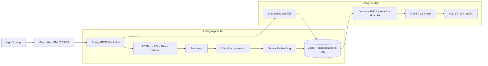

# RAG Document Assistant

Ứng dụng web hỏi đáp nội dung trong tài liệu PDF, DOC và DOCX bằng **Retrieval-Augmented Generation (RAG)**. Hệ thống giữ cấu trúc nội dung, kết hợp tìm kiếm ngữ nghĩa với từ khóa BM25, xếp hạng lại bằng chứng và dùng Gemini để tạo câu trả lời có dẫn nguồn.

> Đồ án môn Java Spring 2 — Java 21, Spring Boot 4, LangChain4j và Gemini API.

## Chức năng

- Tải lên tài liệu PDF, DOC hoặc DOCX, tối đa 10 MB.
- Đọc PDF theo trang bằng PDFBox, giữ hàng/cột bảng DOCX bằng Apache POI, đọc DOC bằng Apache Tika.
- Đọc trang PDF ít chữ/có hình lớn và ảnh PNG/JPEG trong DOCX bằng Gemini Vision; hiển thị lưu ý khi nội dung có thể thiếu.
- Tùy chọn **Đọc kỹ từng trang PDF** cho bảng/sơ đồ khó: gửi mọi trang qua Vision, kiểm tra giới hạn trước khi gọi API.
- Giữ tiêu đề/mục, số trang PDF và chia tài liệu thành các đoạn có phần chồng lấn.
- Tạo embedding bằng `gemini-embedding-001` và lưu bằng `InMemoryEmbeddingStore`.
- Đặt câu hỏi bằng tiếng Việt qua giao diện web.
- Tìm bằng vector + BM25, gộp thứ hạng RRF, rerank bằng Gemini và lấy thêm đoạn liền kề để giữ điều kiện/ngoại lệ. Tài liệu ngắn được đưa trọn vào ngữ cảnh.
- Gộp đoạn lặp trước khi giới hạn ứng viên; nhận diện đầy đủ tên file để tránh chọn nhầm tệp có tên gần giống.
- Sinh câu trả lời bằng `gemini-2.5-flash`, chỉ dựa trên ngữ cảnh truy xuất.
- Hiển thị nguồn gồm tên tệp, tên mục, số trang PDF, số đoạn, độ tương đồng và trích đoạn. Điểm tương đồng không phải xác suất đáp án đúng.
- Bấm vào nguồn để mở bản chữ của tài liệu, tự cuộn đến đoạn liên quan và đánh dấu nổi bật; có thể mở/tải tệp gốc để đối chiếu.
- Xem danh sách tài liệu, số đoạn và xóa dữ liệu khỏi RAM.
- Trả lỗi API thống nhất, không làm lộ API key hoặc chi tiết nội bộ.
- Chọn một tài liệu hoặc toàn thư viện để hỏi; tải lại cùng tên thay bản cũ sau khi đọc thành công.
- Giữ nội dung hộp văn bản, content control, danh sách đánh số, ô gộp dọc và vị trí ảnh DOCX khi xác định được.
- Hiển thị bảng/gạch đầu dòng, bấm `[Nguồn n]` để đối chiếu và sao chép đáp án.
- Nút **Kiểm tra AI** thử chat và embedding thật khi bấm; kiểm tra health thông thường không dùng quota.
- Nếu embedding câu hỏi lỗi tạm thời, tìm bằng BM25 và báo rõ không có điểm ngữ nghĩa. Quota ngày không được tự gọi lặp; quota phút thử lại một lần theo thời gian chờ ngắn của nhà cung cấp.
- Giao diện responsive, chạy chung với backend nên chỉ cần khởi động một ứng dụng.

## Kiến trúc


```mermaid
flowchart LR
    U[Người dùng] --> FE[Giao diện HTML/CSS/JS]
    FE --> API[Spring REST Controller]

    subgraph Indexing[Luồng nạp tài liệu]
        API --> TIKA[PDFBox / POI / Tika + Vision]
        TIKA --> SEC[Tách mục]
        SEC --> CHUNK[Chia đoạn + overlap]
        CHUNK --> EMB[Gemini Embedding]
        EMB --> RAM[(Vector + metadata trong RAM)]
    end

    subgraph Query[Luồng hỏi đáp]
        API --> QEMB[Embedding câu hỏi]
        QEMB --> RAM
        RAM --> TOP[Vector + BM25 + rerank + đoạn kề]
        TOP --> LLM[Gemini 2.5 Flash]
        LLM --> ANSWER[Câu trả lời + nguồn]
    end
```

### Vì sao đây là RAG?

1. **Retrieval:** câu hỏi được đổi thành vector và so sánh với vector của các đoạn tài liệu.
2. **Augmentation:** các đoạn liên quan được ghép vào prompt dưới dạng `[Nguồn 1]`, `[Nguồn 2]`.
3. **Generation:** Gemini tạo câu trả lời từ phần ngữ cảnh đó. Danh sách nguồn do backend lấy trực tiếp từ kết quả truy xuất để người dùng kiểm chứng.

## Công nghệ

| Thành phần | Công nghệ |
|---|---|
| Ngôn ngữ | Java 21 |
| Backend | Spring Boot 4.1.1, Spring Web MVC, Bean Validation |
| RAG | LangChain4j 1.20.0 |
| Đọc tài liệu | Apache PDFBox, Apache POI, Apache Tika 3, Gemini Vision |
| Chat model | Gemini 2.5 Flash |
| Embedding model | Gemini Embedding 001, 768 chiều |
| Vector store | `InMemoryEmbeddingStore<TextSegment>` |
| Frontend | HTML5, CSS3, JavaScript thuần |
| Build | Maven Wrapper 3.9.16 |
| CI | GitHub Actions |

## Frontend nằm ở đâu?

Frontend không có thư mục dự án riêng: Spring Boot phục vụ trực tiếp các file trong `backend/src/main/resources/static`.

| File | Bạn sửa gì ở đây? |
|---|---|
| `static/index.html` | Chữ, các khu vực trên trang, biểu mẫu và cửa sổ xem nguồn |
| `static/css/nova.css` | Giao diện NOVA, màu sắc, bố cục và hiển thị trên điện thoại |
| `static/js/app.js` | Các thao tác upload, hỏi đáp, trạng thái, danh sách tài liệu và mở nguồn |
| `static/js/answer.js` | Hiển thị Markdown giới hạn bằng DOM text nodes; không thực thi HTML của AI/tài liệu |
| `static/js/theme.js` | Khôi phục giao diện sáng/tối trước khi trang vẽ lần đầu |
| `static/js/visuals.js` | Điều hướng, giao diện sáng/tối, chuyển động, ánh sáng và phản hồi tương tác |

Giao diện **NOVA Prism** dùng nền đêm, ánh sáng xanh ngọc và tím dịu, cùng tác phẩm quyển sách bằng kính được tạo riêng. Thanh điều hướng nhỏ ở bên trái, không gian hỏi đáp mở ở giữa và bàn tài liệu bên phải. Các gợi ý câu hỏi được xếp bất đối xứng; ô nhập có ánh sáng khi tập trung. Bấm tên tệp trong thư viện để đọc toàn bộ bản chữ, hoặc bấm trích dẫn để mở khung đọc và đánh dấu đoạn liên quan. Hội thoại, thư viện, nguồn và cửa sổ cá nhân hóa dùng cùng hệ màu và kiểu chữ. Nút **Sáng/Tối** đổi giao diện và nhớ lựa chọn trên trình duyệt.

Hiệu ứng gồm ánh sáng nền chuyển động, các đường sáng và hạt trên canvas, hình kính nổi và phản hồi theo con trỏ, nghiêng gợi ý câu hỏi, gợn sáng khi bấm nút, quầng sáng vùng tải tệp, vệt quét khi thực sự đang phân tích, ánh sáng ô nhập, nguồn xuất hiện và khung đọc trượt vào. Canvas giới hạn ngân sách vẽ 30fps. Nút **Chuyển động** bật/tắt trang trí và nhớ lựa chọn; giao diện tuân theo `prefers-reduced-motion` và dừng chuyển động khi tab bị ẩn. Bấm tên không gian ở góc trên phải (biểu tượng chữ cái trên điện thoại) để đặt biệt danh và câu ký tên; hai thông tin này chỉ lưu trong `localStorage`. Trên điện thoại, khu hỏi đáp xuất hiện trước, có lối đi trực tiếp đến vùng tải tệp và thư viện có thể thu gọn. Ở cửa sổ desktop thấp, màn hình chào cuộn cùng trang để hiển thị đủ nội dung. Phông Manrope, ảnh WebP có nền trong suốt và biểu tượng Tabler đều được lưu cùng ứng dụng, không cần CDN. Giấy phép nằm trong `static/fonts/OFL.txt` và `static/icons/LICENSE.txt`. Xem [ghi chú thiết kế NOVA Prism](docs/PRISM_DESIGN.md) để biết cách áp dụng ba skill frontend và prompt tạo ảnh.

Toàn bộ dùng HTML/CSS/JavaScript thuần, không cần chạy thêm npm hay máy chủ frontend. Sau khi sửa FE, hãy chạy lại `BackendApplication` trong IntelliJ rồi tải lại `http://localhost:8080` để xem bản mới.

## Yêu cầu trước khi chạy

- JDK 21.
- IntelliJ IDEA.
- Git.
- Một Gemini API key từ [Google AI Studio](https://aistudio.google.com/app/apikey).

Tài khoản Google AI Pro/Gemini Pro và API Gemini là hai dịch vụ riêng. Ứng dụng cần **API key**. Không ghi key vào `application.properties`, JavaScript, commit hoặc ảnh chụp màn hình.

## Chạy bằng IntelliJ IDEA

### 1. Clone đúng repository cá nhân

```powershell
cd "D:\MON_HOC_ITC\JavaSpring-2 - RAG"
git clone https://github.com/hoctap970-cloud/rag-document-assistant.git
cd rag-document-assistant
```

Nếu đã clone rồi thì chỉ cần:

```powershell
git switch main
git pull origin main
```

### 2. Mở dự án

1. Mở IntelliJ IDEA.
2. Chọn **File → Open**.
3. Chọn thư mục `rag-document-assistant`.
4. Khi IntelliJ hỏi, chọn **Load Maven Project** cho `backend/pom.xml`.
5. Kiểm tra **File → Project Structure → Project SDK** đang là JDK 21.

### 3. Cấu hình Gemini API key

1. Vào **Run → Edit Configurations**.
2. Chọn cấu hình `BackendApplication`.
3. Tại **Environment variables**, thêm:

   ```text
   GEMINI_API_KEY=API_KEY_CỦA_BẠN
   ```

4. Nhấn **Apply → OK**.
5. Không gửi key cho người khác và không commit key lên GitHub.

### 4. Chạy ứng dụng

Mở [BackendApplication.java](backend/src/main/java/com/hoctap970/rag/BackendApplication.java), nhấn nút tam giác xanh cạnh hàm `main`, sau đó truy cập:

```text
http://localhost:8080
```

Backend đã sẵn sàng khi console có dòng tương tự `Started BackendApplication`.

## Chạy bằng PowerShell

```powershell
cd backend
$env:GEMINI_API_KEY="API_KEY_CỦA_BẠN"
.\mvnw.cmd test
.\mvnw.cmd spring-boot:run
```

Biến môi trường trên chỉ có hiệu lực trong cửa sổ PowerShell hiện tại. Đóng cửa sổ sẽ xóa giá trị khỏi phiên làm việc.

## Cách sử dụng

1. Chọn hoặc kéo thả một tệp PDF/DOC/DOCX.
2. Với PDF khó, có thể chọn **Đọc kỹ từng trang PDF** trước khi nhấn **Phân tích tài liệu**. Chế độ này đọc mọi trang bằng AI, tốn thêm thời gian/quota và mặc định giới hạn 40 trang. Không chọn thì dùng chế độ tự động.
3. Chờ thông báo số vector đã tạo và kiểm tra tài liệu xuất hiện trong **Thư viện**. Có thể bấm tên tệp để đọc bản chữ trích xuất.
4. Nhập câu hỏi có đáp án nằm trong tài liệu.
5. Đọc câu trả lời và bấm một nguồn bên dưới. Cửa sổ sẽ mở bản chữ trích xuất, cuộn đến đoạn được truy xuất và đánh dấu nổi bật đoạn đó. Chọn **Mở tệp gốc** nếu cần xem bố cục PDF/Word ban đầu.
6. Dùng nút `×` để xóa một tài liệu hoặc **Xóa hết** để làm sạch RAM.

## API

| Method | Endpoint | Chức năng |
|---|---|---|
| `GET` | `/api/health` | Backend, key đã cấu hình hay chưa, số tài liệu và số đoạn; không chứng minh AI phản hồi |
| `POST` | `/api/health/ai` | Thử chat và embedding thật, dùng quota; trả từng trạng thái, model và thời điểm kiểm tra |
| `POST` | `/api/documents/upload` | Nhận multipart `file`, tùy chọn `readMode=AUTO` hoặc `DEEP` (PDF), đọc và tạo vector |
| `GET` | `/api/documents` | Danh sách tài liệu trong RAM |
| `GET` | `/api/documents/{id}/content` | Bản chữ và các đoạn của tài liệu để đối chiếu nguồn |
| `GET` | `/api/documents/{id}/original` | Mở PDF gốc hoặc tải Word gốc từ RAM |
| `DELETE` | `/api/documents/{id}` | Xóa một tài liệu và các vector của nó |
| `DELETE` | `/api/documents` | Xóa toàn bộ tài liệu và vector |
| `POST` | `/api/chat` | JSON `{ "question": "...", "documentIds": ["uuid"] }`; bỏ `documentIds` hoặc mảng rỗng để hỏi toàn thư viện |

`sources[].score` là số tương đồng ngữ nghĩa khi có; bằng `null` khi embedding câu hỏi lỗi và dùng tìm kiếm từ khóa. Không phải độ chính xác đáp án. Mã tài liệu đã xóa trong `documentIds` trả 400, không tự hỏi sang tệp khác.

Xem [báo cáo kiểm tra trước demo](docs/DEMO_READINESS.md) để biết các trường hợp đã thử thật, giới hạn còn lại và cách xử lý quota.

Ví dụ kiểm tra health:

```powershell
curl.exe http://localhost:8080/api/health
```

Ví dụ upload:

```powershell
curl.exe -X POST -F "file=@D:\TaiLieu\bai-giang.pdf" http://localhost:8080/api/documents/upload
```

Ví dụ đặt câu hỏi:

```powershell
curl.exe -X POST `
  -H "Content-Type: application/json" `
  -d '{"question":"RAG gồm những thành phần nào?"}' `
  http://localhost:8080/api/chat
```

## Cấu hình RAG

Các giá trị nằm trong `backend/src/main/resources/application.properties`:

| Thuộc tính | Mặc định | Ý nghĩa |
|---|---:|---|
| `app.rag.chunk-size` | `1500` | Số ký tự mục tiêu trước khi thêm tiêu đề ngữ cảnh |
| `app.rag.chunk-overlap` | `220` | Phần chồng lấn ở ranh giới |
| `app.rag.max-chunks-per-document` | `800` | Chặn tài liệu quá lớn gây tốn quota |
| `app.rag.max-results` | `14` | Số đoạn chính; có thể thêm đoạn kề hoặc độ phủ cho câu tổng quan |
| `app.rag.min-score` | `0.35` | Ngưỡng nhánh vector; BM25 vẫn có thể lấy đoạn có score thấp |
| `app.rag.candidate-count` | `40` | Số ứng viên trước rerank |
| `app.rag.max-context-characters` | `48000` | Ngân sách ngữ cảnh, tính cả nhãn nguồn ước lượng |
| `app.rag.full-context-characters` | `24000` | Dưới ngưỡng này dùng toàn bộ các đoạn trong phạm vi truy vấn |
| `app.rag.neighbor-window` | `1` | Lấy thêm đoạn trước/sau cùng tài liệu |
| `app.rag.rerank-enabled` | `true` | Thêm lượt Gemini xếp hạng lại khi cần |
| `app.parsing.vision-enabled` | `true` | Đọc trang/hình bằng AI; có thể đặt `RAG_VISION_ENABLED=false` |
| `app.parsing.max-pdf-pages` | `250` | Giới hạn trang PDF mỗi tệp |
| `app.parsing.max-vision-pages` | `40` | Giới hạn trang/hình đọc qua Gemini mỗi tệp |
| `app.gemini.embedding-dimensions` | `768` | Số chiều vector embedding |
| `app.gemini.max-output-tokens` | `8192` | Giới hạn đầu ra mỗi lượt chat/vision/rerank |

Đặt `GEMINI_CHAT_MODEL` hoặc `GEMINI_EMBEDDING_MODEL` trong Run Configuration để đổi model. Sau khi đổi embedding model phải nạp lại tài liệu. Xem [hướng dẫn nâng chất lượng và đề thử có nhiễu](docs/RAG_QUALITY_GUIDE.md).

## Giới hạn hiện tại

- Vector, bản chữ và tệp gốc được lưu trong RAM theo đúng yêu cầu đề bài; dừng ứng dụng sẽ mất dữ liệu. Tệp không được ghi vào repository hoặc ổ đĩa bởi ứng dụng.
- Cửa sổ xem nguồn hiển thị bản chữ trích xuất và chia đoạn, nên không giữ nguyên bố cục PDF/Word. Các đoạn kề nhau có thể lặp một ít chữ vì cấu hình overlap; nút **Mở tệp gốc** dùng để kiểm tra định dạng ban đầu.
- Scan mờ, bảng gộp ô, công thức, biểu đồ hoặc thứ tự đọc nhiều cột vẫn có thể sai. Vision tự động dựa theo lượng chữ/hình lớn; dùng chế độ đọc kỹ PDF để xử lý mọi trang. File DOC chỉ đọc lớp chữ. Xem lưu ý của từng tài liệu.
- Tài liệu dài chỉ đưa các đoạn được chọn vào lượt trả lời; câu tổng quan có cảnh báo nếu chưa phủ hết tài liệu. Không bảo đảm đúng mọi câu hỏi hay mọi định dạng.
- Việc nhận diện mục dựa trên tiêu đề được trích xuất từ tài liệu. Với tài liệu định dạng kém, nguồn có thể hiện `Nội dung chính`.
- Chất lượng trả lời phụ thuộc nội dung tài liệu, cách đặt câu hỏi, Gemini API và hạn mức của tài khoản.
- Đây là ứng dụng demo cục bộ, chưa có đăng nhập và phân quyền người dùng.

## Kiểm thử và đóng gói

```powershell
cd backend
.\mvnw.cmd clean test
.\mvnw.cmd clean package
java -jar target\backend-0.0.1-SNAPSHOT.jar
```

Kiểm thử gồm Spring context, upload, tách mục, đọc PDF/DOCX thực, truy xuất câu khó giữa dữ liệu nhiễu, đoạn ngoại lệ, ngân sách ngữ cảnh, số trang và mã nguồn. Các kiểm thử thường dùng model giả nên không đo độ chính xác Gemini thực. GitHub Actions tự chạy kiểm thử Java, kiểm thử frontend bằng Node và `package` trên mọi pull request hoặc push vào `main`.

Sau `test`, bộ đề giả lập 5 câu nằm trong `backend/target/rag-evaluation/`. Bài đánh giá gọi Gemini thật chỉ chạy khi bật `RUN_LIVE_RAG_EVAL=true`; xem [hướng dẫn đánh giá](docs/RAG_QUALITY_GUIDE.md).

Kiểm tra trạng thái và sự kiện frontend bằng Node.js 20 trở lên (không cần cài gói npm), từ thư mục gốc repository:

```powershell
node --test backend/src/test/js/app.test.cjs backend/src/test/js/visuals.test.cjs
```

Bộ kiểm tra này bao gồm mất kết nối/kết nối lại, kéo thả khi đang upload, chặn upload trong lúc hỏi đáp, giữ câu hỏi khi API lỗi, trạng thái nút gửi, nhập chữ bằng IME và mở toàn bộ bản chữ từ thư viện. Các kiểm thử hiệu ứng xác nhận dừng/khôi phục vòng vẽ khi đổi tab hoặc tắt chuyển động, tuân theo lựa chọn giảm chuyển động, khôi phục giao diện trước khi vẽ và hoạt động khi trình duyệt chặn lưu trữ. Bố cục và cửa sổ xem nguồn cần kiểm tra thêm trên trình duyệt ở màn hình laptop và điện thoại.

## Quy trình Git/GitHub đề xuất

```powershell
git switch main
git pull origin main
git switch -c feat/ten-chuc-nang

# Sau khi sửa và kiểm thử
git status
git diff
git add .
git commit -m "feat: mo ta ngan gon thay doi"
git push -u origin feat/ten-chuc-nang
```

Sau đó tạo Pull Request trên GitHub, kiểm tra tab **Files changed** và **Actions**, rồi mới merge vào `main`. Quy ước commit dùng `feat:`, `fix:`, `docs:`, `test:` và `chore:`.

## Tài liệu dành cho người học

- [Giải thích chi tiết kiến trúc và từng file](docs/PROJECT_GUIDE.md)
- [Kịch bản demo và 5 câu hỏi kiểm thử](docs/DEMO_GUIDE.md)
- [Nâng chất lượng RAG, giới hạn và đề thử có nhiễu](docs/RAG_QUALITY_GUIDE.md)
- [Quy ước đóng góp và làm việc với Git](CONTRIBUTING.md)

## Tài liệu kỹ thuật tham khảo

- [LangChain4j — Retrieval-Augmented Generation](https://docs.langchain4j.dev/tutorials/rag/)
- [LangChain4j — Google Gemini](https://docs.langchain4j.dev/integrations/language-models/google-genai/)
- [LangChain4j — In-memory embedding store](https://docs.langchain4j.dev/integrations/embedding-stores/in-memory/)
- [Google AI — Gemini API key](https://ai.google.dev/gemini-api/docs/api-key)

## Bảo mật

- API key chỉ được đọc từ biến môi trường `GEMINI_API_KEY` ở backend.
- `.env` đã nằm trong `.gitignore`.
- Frontend không nhận và không lưu API key.
- Tệp tải lên, bản chữ và vector chỉ được giữ trong RAM; ứng dụng không ghi bản gốc xuống ổ đĩa. Xóa tài liệu hoặc dừng ứng dụng sẽ bỏ dữ liệu này.
- Nếu lỡ đưa key lên GitHub, hãy thu hồi key đó ngay trong Google AI Studio và tạo key mới.
